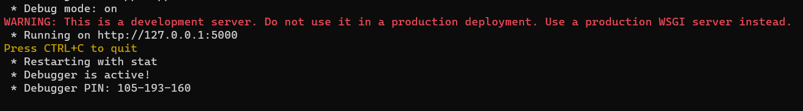

# Projet : Application Web de Service Vélib'

## Compétences de la SAE en BUT 2

1. **Réaliser un développement d'application** _(réaliser)_  
   Capacité à concevoir et développer des applications adaptées aux besoins spécifiques.

2. **Optimiser des applications** _(optimiser)_  
   Savoir améliorer les performances et l'efficacité des applications existantes.

3. **Administrer des systèmes informatiques communicants complexes** _(administrer)_  
   Maîtrise de l'administration des systèmes et réseaux avancés.

4. **Gérer des données de l'information** _(gérer)_  
   Compétence dans la manipulation, l'organisation et la sécurité des données.

5. **Conduire un projet** _(conduire)_  
   Gestion des différentes étapes d'un projet informatique, de la conception à la livraison.

6. **Collaborer au sein d'une équipe informatique** _(collaborer)_  
   Aptitude à travailler en collaboration dans un environnement de développement.

# Livrable 1 : Scripts d'administration

### Sommaire

1. [Description du Projet](#description)
   - [Fonctionnalités principales](#fonctionnalités-principales-de-notre-application-)
   - [Défis rencontrés lors de la réalisation](#défis-rencontrés-lors-de-la-réalisation-)
2. [Rôle du Script Python](#rôle-du-script-python)
3. [Prérequis](#prérequis)
4. [Installation](#installation)
5. [Explication du Fonctionnement du Script Python](#explication-du-fonctionnement-du-script-python)
   - [Étape 1 : Récupération des données et traitement](#1-récupération-des-données-et-traitement)
     - [Envoi de la requête à l'API](#11-envoi-de-la-requête-à-lapi)
     - [Vérification de la validité de la réponse](#12-vérification-de-la-validité-de-la-réponse)
     - [Extraction des données JSON](#13-extraction-des-données-json)
     - [Filtrage et validation des données](#14-filtrage-et-validation-des-données)
   - [Étape 2 : Retourner les données traitées pour utilisation dans l'application](#2-retourner-les-données-traitées-pour-utilisation-dans-lapplication)
     - [Renvoyer les données formatées](#21-renvoyer-les-données-formatées)
     - [Exposer les données via une API avec Flask](#22-exposer-les-données-via-une-api-avec-flask)
     - [Comment accéder à l'API exposée avec Flask](#23-comment-accéder-à-lapi-exposée-avec-flask-)
6. [Usage](#usage)
7. [Informations Importantes à Savoir](#informations-importantes-à-savoir)
   - [Explication de CORS(app)](#explication-de-corsapp-)
8. [Conclusion](#conclusion)

## Description

Ce projet porte sur la mise au point d’une application Web pour l’accès et l’utilisation du service de vélos en libre-service Vélib’ à savoir un réseau de stations de vélos mécaniques et électriques sur le territoire de la ville de Paris et à son agglomération.

L’application permet aux utilisateurs de visualiser sur une carte interactive l’ensemble des stations de vélos Vélib’ avec des informations afférentes (nom de la station, géolocalisation, capacité (nombre de vélos disponibles)).
L’utilisateur peut interagir avec la carte, consulter les informations accordées à l’une des stations, réserver un vélo ou bien encore planifier son itinéraire vers une station.
Les informations sur les stations de vélos sont collectées en temps réel à partir des API ouvertes de Vélib’. Ces API fournit plusieure donnees comme des informations sur chacune des stations : ID de la station, nom de la station, géolocalisation (latitude et longitude) et capacité de la station.
Ces élément sont par la suite traitées et formatées pour être affichées sur l’application.

### Fonctionnalités principales de notre application :

- **Visualisation des stations Vélib'** : Carte interactive affichant la totalité des stations de vélos mises à jour en temps-réel via l’API publique de Vélib’.
- **Détails des stations** : En cliquant sur une station, l’utilisateur peut avoir accès à des informations sur elle (nom, géolocalisation, capacité).
- **Réservation de vélos** : L’utilisateur peut réserver à une station un vélo disponible.
- **Planification d'itinéraires** : L’utilisateur peut planifier son itinéraire vers une station.
- **Historique des réservations et recherches** : L’utilisateur peut se connecter à son compte pour consulter l’historique de ses recherches et réservations.

### Défis rencontrés lors de la réalisation :

Parmi les difficultés majeures qui ont été rencontrées lors de l’élaboration de cette application: l’indexation et le traitement des données fournies par l’API Vélib’. Car l’API donne l'accessibilité à une grande quantité de données qui parfois, apparaissent incomplètes voire mal formées ; le point problématique a donc consisté à s’assurer de la capacité à faire une extraction correcte et une valorisation adéquate des données utiles.
Finalement, après de longues recherches, la solution retenue a été de se pencher sur l’usage de Python comme langage de script.

## Rôle du script Python

Le script Python joue un rôle central dans le projet en effectuant les étapes suivantes :

1. **Envoi de la requête à l'API** pour récupérer les données des stations Vélib'.
2. **Traitement et validation des données** : Les informations récupérées sont filtrées et structurées selon les besoins de l'application (nom de la station, géolocalisation, capacité ect).
3. **Renvoi des données formatées** sous forme de JSON vers le frontend, permettant à l'application de les afficher sur la carte interactive.

## Prérequis

- **Python 3.8+** doit être installé.
- Bibliothèques Python nécessaires :
  - `Flask` pour le serveur web.
  - `Flask-CORS` pour la gestion des CORS.
  - `requests` pour les requêtes HTTP.

## Installation

1. **Télécharge le fichier ZIP** contenant le projet.
2. **Décompresse le fichier ZIP** dans un dossier spécifique.
3. **Accéder au dossier du projet** avec le terminal :
   ```bash
   cd chemin_vers_le_dossier_du_projet
   ```
4. **Installation des bibliothèques Python** la commande:
   ```bash
   pip install Flask Flask-CORS requests
   ```
   <br>

# Explication du Fonctionnement du Script Python

Dans cette section, nous allons expliquer en détail le fonctionnement du script `script.py` ligne par ligne ,nous diviserons l'explication en deux étapes clés pour que vous puissiez comprendre facilement comment le code fonctionne.

## 1-Récupération des données et traitement

Pour La première étape il faut se concetrer sur la fonction `get_stations()` qui consiste à récupérer les données des stations Vélib' via une requête API, puis à traiter ces données pour les rendre exploitables dans notre application. Voici les différentes étapes du code :

### 1.1. Envoi de la requête à l'API:

```python
response = requests.get("https://velib-metropole-opendata.smovengo.cloud/opendata/Velib_Metropole/station_information.json")
```

- `requests.get()` : Cette méthode envoie une requête HTTP GET à l'URL de l'API de Vélib' pour récupérer les données des stations de vélos.
- `response` : La variable response contient la réponse du serveur à la requête. Cette réponse contient les informations demandées sous forme de JSON, ou un message d'erreur en cas d'échec.

### 1.2. Vérification de la validité de la réponse:

Après avoir envoyé la requête, nous devons vérifier si la réponse du serveur est correcte (code de statut 200) avant de continuer à traiter les données.

```python
if response.status_code == 200:
```

- `response.status_code` : C'est le code de statut HTTP renvoyé par le serveur. Un code 200 indique que la requête a réussi et que nous pouvons maintenant traiter les données.

### 1.3. Extraction des données JSON:

Une fois que nous avons validé la réponse, nous extrayons les données JSON de la réponse en utilisant la méthode `.json()` :

```python
data = response.json()
```

- `response.json()` : Cette méthode convertit la réponse de l'API (qui est un objet JSON) en un dictionnaire Python que nous pouvons facilement manipuler.

### 1.4. Filtrage et validation des données:

Les données extraites contiennent des informations sur chaque station de vélo. Nous devons les filtrer et nous assurer qu'elles sont dans un format valide avant de les utiliser. Cela se fait avec une boucle et des vérifications de type :

```python
formatted_data = []

        # Filtrage et structuration des données
        for station in data.get('data', {}).get('stations', []):
            # Validation des champs et types requis
            if (
                isinstance(station.get('station_id'), int) and
                isinstance(station.get('stationCode'), str) and
                isinstance(station.get('name'), str) and
                isinstance(station.get('lat'), float) and
                isinstance(station.get('lon'), float) and
                isinstance(station.get('capacity'), int)
            ):
                # Ajouter la station avec les champs formatés dans la liste finale
                formatted_station = {
                    "station_id": station['station_id'],
                    "stationCode": station['stationCode'],
                    "name": station['name'],
                    "lat": station['lat'],
                    "lon": station['lon'],
                    "capacity": station['capacity']
                }
                formatted_data.append(formatted_station)
```

- `data.get('data', {}).get('stations', [])` : Cela permet d'accéder de manière sécurisée aux données des stations dans la réponse JSON. Si les clés n'existent pas, un dictionnaire vide est retourné, évitant ainsi des erreurs.
- **Vérifications de type** : Nous nous assurons que chaque donnée (comme l'ID de station, le nom, la latitude, etc.) est du type attendu en utilisant `isinstance()`.
- **Filtrage**: Si une station est valide, nous extrayons ses informations et les ajoutons à la liste `formatted_data`.

## 2-Retourner les données traitées pour utilisation dans l'application

Jusqu'à présent, nous avons vu comment la fonction `get_stations()` récupère et filtre les données. La question qui se pose maintenant est : comment pouvons-nous récupérer ces données dans notre application web ?

La réponse est: l'utilisation de la bibliothèque `Flask`. Flask est un micro-framework pour Python qui permet de créer des API REST.

Une API REST (Representational State Transfer) est un type d'interface qui permet à une application web d'interagir avec un serveur via des requêtes HTTP (GET, POST...).

Flask facilite la création de ces API en définissant des "routes" qui répondent à des requêtes spécifiques.

Dans notre projet, `Flask` permet de créer une API qui renvoie les données des stations Vélib' sous forme de JSON. Cela permet à notre application web de récupérer facilement ces données pour les afficher sur la carte. Voici les différentes étapes du code :

### 2.1. Renvoyer les données formatées:

Nous utilisons la méthode `jsonify()` de Flask pour retourner les données traitées au format JSON :

```python
return jsonify(formatted_data)
```

- `jsonify(formatted_data)` : Cette fonction permet de convertir la liste formatted_data en un objet JSON. Ce format est compatible avec le frontend et peut être facilement interprété par JavaScript.

### 2.2. Exposer les données via une API avec Flask:

Une fois que les données sont récupérées et formatées, l'étape suivante consiste à exposer ces données via une API afin que l'application frontend puisse y accéder et les utiliser. Flask facilite cela en permettant de créer facilement des routes qui rendront l'API accessible.

Voici comment cela fonctionne :

```python
@app.route('/stations', methods=['GET'])
def get_stations():
    # Code
    return jsonify(formatted_data)

```

- `@app.route('/stations', methods=['GET'])` : Cette ligne définit une route dans Flask. Elle indique que chaque fois qu'une requête GET est envoyée à l'URL `/stations`, la fonction `get_stations()` sera appelée.
- `def get_stations()` : C'est la fonction qui sera exécutée lorsque la route `/stations` sera demandée. Elle récupère les données, les filtre et les formate avant de les renvoyer.

### 2.3. Comment accéder à l'API exposée avec Flask :

Une fois l'API exposée avec Flask, elle devient accessible sur le serveur local (localhost) à l'adresse suivante : http://localhost:5000.

- `:5000` est le port par défaut que Flask utilise pour servir l'API.\*

Pour récupérer les données exposées par l'API, le frontend utilise une requête HTTP GET.Dans un fichier JavaScript, on peut utiliser la fonction `fetch()` pour envoyer cette requête à l'URL définie par Flask (ici, /stations).

Voici un exemple de code JavaScript pour récupérer les données de l'API :

```javascript
fetch("http://localhost:5000/stations")
  .then((response) => response.json()) // Convertir la réponse en format JSON
  .then((data) => {
    console.log(data); // Afficher les données dans la console
  })
  .catch((error) => {
    console.error("Erreur lors de la récupération des données:", error);
  });
```

- `fetch('http://localhost:5000/stations')` : Cette ligne envoie une requête GET à l'URL http://localhost:5000/stations. Cela signifie que l'application frontend va chercher les données à l'adresse où l'API Flask est hébergée.
- `.then(response => response.json())` : Lorsque la requête est réussie, la réponse est reçue au format JSON, et nous la convertissons pour pouvoir l'utiliser dans notre application.
- `.then(data => { console.log(data); })` : Ensuite, nous pouvons utiliser les données dans notre application (par exemple, les afficher dans l'interface utilisateur).
- `.catch(error => { console.error('Erreur:', error); })` : Si quelque chose ne va pas avec la requête, une erreur est capturée et affichée dans la console.<br><br>

# Usage

Après avoir téléchargé et extrait le fichier ZIP, vous aurez un dossier structuré de la manière suivante :

```
Scripte_Livrable1/
├── README.md
├── images
│   └──*.png
├── UsageTest
│   └── testScript.html
└── script.py
```

Pour comprendre comment utiliser le script Python, il vous suffit de vous rendre dans le dossier `UsageTest`, où vous trouverez un fichier `testScript.html`. Ce fichier récupère les données de l'API Flask avec `fetch` [comme expliqué précédemment](#23-comment-accéder-à-lapi-exposée-avec-flask-) et les affiche en frontend sous forme de tableau.

Ce test est conçu uniquement pour illustrer comment exécuter le fichier `script.py` et de voir s'il est prêt à être intégré dans notre application web.

L'utilisation est simple : il vous suffit d'exécuter la commande suivante dans votre terminal :

```bash
python script.py
```

- `python script.py`: Cette commande va exécuter le script Python et démarrer automatiquement Flask, qui exposera l'API pour que vous puissiez y accéder depuis le frontend.

Si tout fonctionne correctement, l'affichage sera :



_Cela signifie que l'API est en cours d'exécution et prête à être utilisée._

- ### Ensuite, pour vérifier si une application web peut réellement accéder à cette API, il suffit de cliquer sur le fichier `testScript.html`. Cela ouvrira une page web qui affichera un tableau contenant les informations récupérées depuis l'API Flask.

- ### Alternativement, vous pouvez également accéder directement à l'API via un navigateur web : `http://localhost:5000/stations`, où vous verrez un fichier JSON affichant toutes les informations des stations.
<br>

# Informations Importantes à Savoir

### Explication de CORS(app) :

- CORS (Cross-Origin Resource Sharing) : Cette ligne est requise afin d’autoriser l’application Flask à accepter l’input de sources externes.CORS est une politique de sécurité intégrée dans la plupart des navigateurs modernes pour des raisons de sécurité. En train de l’activé, vous autorisez votre API Flask à mener une conversation entre deux domaines différents.

Sans CORS, une application front-end exécutée sur un autre domaine serait bloquée lorsqu'elle tente d'effectuer une requête vers ton API Flask.

# Conclusion

La clé de ce script est, bien entendu, l’utilisation de Flask, qui peut créer une API flexible capable d’exécuter n’importe quel script Python que nous écrivons.

Cette bibliothèque est très utile pour créer des API qui retournent des données extraites d’autres API publiques. Par exemple, si une API publique renvoie 10 données, mais que nous n'avons besoin que de 5, Flask nous permet de retourner uniquement ces 5 données spécifiques.

En outre, Flask nous permet d'ajouter facilement des entrées depuis notre application web et de les intégrer dans le routeur de Flask. Voici un exemple :

```python
@app.route('/station/<int:station_id>', methods=['GET'])
def get_station_info(station_id):
    # Récupérer toutes les stations pour trouver celle qui correspond à station_id
    response = requests.get("https://velib-metropole-opendata.smovengo.cloud/opendata/Velib_Metropole/station_status.json")
    if response.status_code == 200:
    #.....Code
    # Pas de spoiler, on verra ça un peu plus tard ! 😉
```

- `/station/<int:station_id>'`: Ici, nous spécifions un paramètre de type int afin de l'utiliser dans la fonction `get_station_info(station_id)`.

### Flask offre de nombreuses autres fonctionnalités puissantes que nous explorerons plus en détail dans les prochaines étapes.
